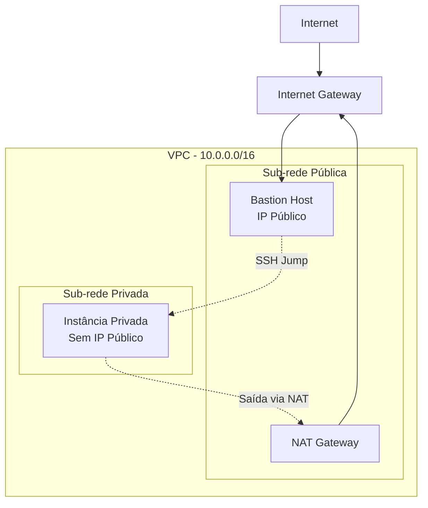

# 🔐 AWS Lab 16: Secure Network Architecture & Advanced SSH Management

[](https://aws.amazon.com/)
[](#)
[](#)
[](#)

##  Visão Geral

Este repositório documenta a implementação de uma **arquitetura de rede multicamadas na AWS**, focada em **Segurança em Profundidade (Defense in Depth)**. O projeto estabelece uma VPC isolada onde recursos críticos são protegidos em sub-redes privadas, utilizando um **Bastion Host** como único ponto de entrada administrativo e um **NAT Gateway** para comunicações de saída controladas.

---

##  Objetivos Técnicos

-  **Segregação de Redes:** Implementação de Sub-redes Públicas e Privadas em conformidade com o *AWS Well-Architected Framework*
-  **Gestão de Roteamento:** Configuração estratégica de Tabelas de Rotas para Internet Gateway (IGW) e NAT Gateway
-  **Hardening de Acesso:** Provisionamento de um Bastion Host (Jump Box) para administração segura de instâncias isoladas
-  **Conectividade Avançada:** Domínio de técnicas de tunelamento e encaminhamento de chaves via SSH

---

##  Arquitetura da Solução



---

##  Detalhes da Infraestrutura

| Componente | Especificação Técnica | Função |
|------------|----------------------|--------|
| **VPC** | CIDR Customizado (ex: `10.0.0.0/16`) | Isolamento lógico do ambiente de nuvem |
| **Sub-rede Pública** | `10.0.1.0/24` | Hospeda Bastion Host e NAT Gateway |
| **Sub-rede Privada** | `10.0.2.0/24` | Hospeda recursos protegidos sem IP público |
| **Internet Gateway** | Gerenciado pela AWS | Conectividade bidirecional com a internet |
| **NAT Gateway** | Alta disponibilidade | Saída controlada para instâncias privadas |
| **Bastion Host** | EC2 t3.micro (Amazon Linux 2023) | Ponto único de auditoria e acesso SSH |
| **Security Groups** | Stateful Inspection | Regras restritivas (porta 22 apenas) |

---

##  Implementação Passo a Passo

### Fase 1: Infraestrutura de Rede

```bash
# 1. Criar VPC
aws ec2 create-vpc --cidr-block 10.0.0.0/16

# 2. Criar Sub-redes
aws ec2 create-subnet --vpc-id vpc-xxx --cidr-block 10.0.1.0/24  # Pública
aws ec2 create-subnet --vpc-id vpc-xxx --cidr-block 10.0.2.0/24  # Privada

# 3. Criar e anexar Internet Gateway
aws ec2 create-internet-gateway
aws ec2 attach-internet-gateway --vpc-id vpc-xxx --internet-gateway-id igw-xxx

# 4. Criar NAT Gateway
aws ec2 create-nat-gateway --subnet-id subnet-public --allocation-id eipalloc-xxx
```

### Fase 2: Configuração de Roteamento

**Tabela de Rotas Pública:**
```bash
Destino         Target
0.0.0.0/0       igw-xxxxxx
10.0.0.0/16     local
```

**Tabela de Rotas Privada:**
```bash
Destino         Target
0.0.0.0/0       nat-xxxxxx
10.0.0.0/16     local
```

### Fase 3: Security Groups

**Bastion Host Security Group:**
```yaml
Inbound:
  - Type: SSH
    Port: 22
    Source: <SEU_IP>/32  # Seu IP público
Outbound:
  - Type: All Traffic
    Destination: 0.0.0.0/0
```

**Instância Privada Security Group:**
```yaml
Inbound:
  - Type: SSH
    Port: 22
    Source: <IP_PRIVADO_BASTION>/32
Outbound:
  - Type: All Traffic
    Destination: 0.0.0.0/0
```

---

##  Configuração Avançada de SSH

###  SSH Agent Forwarding

Permite autenticar na instância privada usando a chave local, **sem copiar credenciais para o Bastion**.

```bash
# No ambiente local:
ssh-add ~/.ssh/aws-key.pem              # Adiciona a chave ao agente
ssh-add -l                               # Verifica chaves carregadas

# Conecta ao Bastion com Agent Forwarding:
ssh -A ec2-user@<BASTION_PUBLIC_IP>

# Dentro do Bastion:
ssh ec2-user@<PRIVATE_INSTANCE_IP>      # Acesso transparente
```

####  Segurança do Agent Forwarding
-  Chaves privadas nunca saem da máquina local
-  Reduz superfície de ataque (sem arquivos .pem no Bastion)
-  Use apenas em ambientes confiáveis

---

###  Configuração Permanente via `~/.ssh/config`

Para automatizar o processo e eliminar comandos repetitivos:

```ssh
# ~/.ssh/config

# Configuração do Bastion Host
Host bastion
    HostName <BASTION_PUBLIC_IP>
    User ec2-user
    IdentityFile ~/.ssh/aws-key.pem
    ForwardAgent yes

# Acesso Direto à Instância Privada (ProxyJump)
Host aws-private
    HostName <PRIVATE_INSTANCE_IP>
    User ec2-user
    ProxyJump bastion
    ForwardAgent yes
```

**Uso simplificado:**
```bash
ssh aws-private  # Conecta diretamente à instância privada!
```

---

###  ProxyJump (Método Moderno - OpenSSH 7.3+)

Conexão direta em um único comando:

```bash
# Sintaxe básica:
ssh -J ec2-user@<BASTION_IP> ec2-user@<PRIVATE_IP>

# Ou com múltiplos saltos:
ssh -J bastion1,bastion2 ec2-user@<PRIVATE_IP>
```

---

###  Transferência de Arquivos (SCP/SFTP)

```bash
# Upload para instância privada:
scp -o ProxyJump=ec2-user@<BASTION_IP> arquivo.txt ec2-user@<PRIVATE_IP>:/home/ec2-user/

# Download de instância privada:
scp -o ProxyJump=ec2-user@<BASTION_IP> ec2-user@<PRIVATE_IP>:/var/log/app.log ./

# Usando configuração do ~/.ssh/config:
scp arquivo.txt aws-private:/home/ec2-user/
```

---

###  Túneis SSH (Port Forwarding)

#### Acessar aplicação web interna:
```bash
# Criar túnel local -> instância privada (porta 80)
ssh -L 8080:<PRIVATE_IP>:80 -J <BASTION_IP> ec2-user@<PRIVATE_IP>

# Acessar no navegador:
# http://localhost:8080
```

#### Conectar a banco de dados privado:
```bash
# Túnel para PostgreSQL
ssh -L 5432:<PRIVATE_IP>:5432 ec2-user@<BASTION_IP>

# Conectar via cliente local:
psql -h localhost -p 5432 -U dbuser -d production
```

---

##  Melhores Práticas de Segurança

### Configuração do Bastion Host (`/etc/ssh/sshd_config`)

```bash
# Desabilitar autenticação por senha
PasswordAuthentication no

# Apenas chaves públicas
PubkeyAuthentication yes

# Desabilitar login root
PermitRootLogin no

# Limitar usuários permitidos
AllowUsers ec2-user admin

# Timeout de sessão ociosa
ClientAliveInterval 300
ClientAliveCountMax 2
```

### Proteção de Chaves Privadas

```bash
# Permissões corretas (obrigatório)
chmod 400 ~/.ssh/aws-key.pem

# Verificar fingerprint na primeira conexão
ssh-keygen -l -f ~/.ssh/aws-key.pem

# Remover chaves do agente após uso
ssh-add -D
```

### Auditoria e Monitoramento

```bash
# Verificar logs de acesso SSH no Bastion
sudo tail -f /var/log/secure  # Amazon Linux/CentOS
sudo tail -f /var/log/auth.log  # Ubuntu/Debian

# Habilitar CloudWatch Logs para auditoria centralizada
aws logs create-log-group --log-group-name /aws/ec2/bastion
```

---

##  Validação de Conectividade

### Checklist de Testes

 Ping do Bastion para Internet (via IGW)
 SSH do local para Bastion Host
 SSH do Bastion para Instância Privada
 Instância Privada consegue baixar pacotes (via NAT Gateway)
 Instância Privada **NÃO** aceita conexões SSH diretas da Internet
 ProxyJump funciona em um único comando

### Comandos de Validação

```bash
# No Bastion - testar conectividade com a Internet:
ping -c 4 8.8.8.8

# Na Instância Privada - testar saída via NAT:
curl -I https://www.google.com

# Testar acesso direto (deve FALHAR):
ssh ec2-user@<PRIVATE_IP>  # Timeout esperado

# Testar via ProxyJump (deve FUNCIONAR):
ssh -J bastion aws-private
```

---

##  Troubleshooting

| Problema | Possível Causa | Solução |
|----------|---------------|---------|
| `Permission denied (publickey)` | Chave não carregada no agente | `ssh-add ~/.ssh/aws-key.pem` |
| `Connection timed out` | Security Group bloqueando | Verificar regras de entrada/saída |
| Agent Forwarding não funciona | Flag `-A` ausente | Adicionar `ForwardAgent yes` no config |
| Instância privada sem internet | Rota NAT incorreta | Verificar tabela de rotas da subnet privada |
| ProxyJump falha | Bastion não alcança instância | Testar conectividade: `telnet <PRIVATE_IP> 22` |

---

##  Referências Técnicas

- [AWS VPC Documentation](https://docs.aws.amazon.com/vpc/)
- [Bastion Host Security Best Practices](https://aws.amazon.com/quickstart/architecture/linux-bastion/)
- [OpenSSH Manual - ssh_config](https://man.openbsd.org/ssh_config)
- [RFC 4254 - SSH Connection Protocol](https://www.rfc-editor.org/rfc/rfc4254)
- [AWS Well-Architected Framework - Security Pillar](https://docs.aws.amazon.com/wellarchitected/latest/security-pillar/)

---

##  Conclusão

O **Lab 16** consolida a habilidade de arquitetar redes seguras e gerenciar acessos remotos de forma profissional. A utilização de NAT Gateways e Bastion Hosts representa o **padrão ouro** para infraestruturas que priorizam a **integridade dos dados** e o **isolamento de backends**.

**Principais Conquistas:**
-  Implementação de arquitetura multi-tier conforme AWS Well-Architected Framework
-  Domínio de técnicas avançadas de SSH (Agent Forwarding, ProxyJump, Tunneling)
-  Hardening de segurança em conformidade com CIS Benchmarks
-  Automação de processos de acesso via arquivos de configuração

---

##  Licença e Disclaimer

> **Aviso Legal:** Este projeto é parte de uma jornada de aprendizado técnico em AWS. Todos os direitos sobre os logotipos e nomes de serviços pertencem à **Amazon Web Services, Inc.** Esta documentação foi elaborada exclusivamente para fins educacionais e de portfólio técnico.

---

##  Autor
Kaylane Kimberly
Desenvolvido como parte do programa de treinamento AWS Solutions Architect.

**Status do Projeto:**  Concluído com Sucesso  
**Ambiente:** AWS Cloud  
**Data:** Fevereiro 2026

---

<div align="center">

###  Se este projeto foi útil, considere dar uma estrela!

[](https://github.com)
[](https://linkedin.com)

</div>
